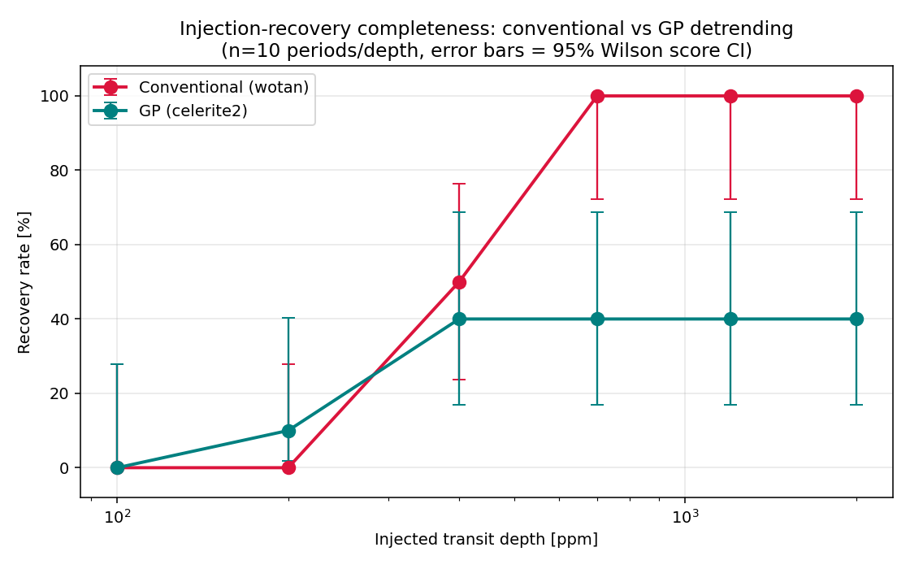
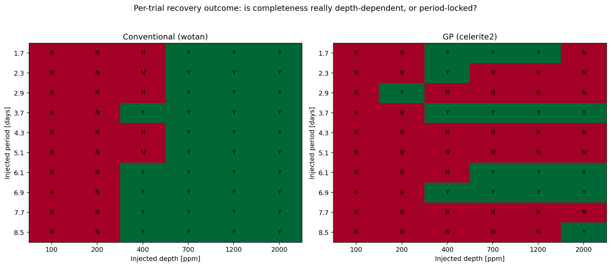
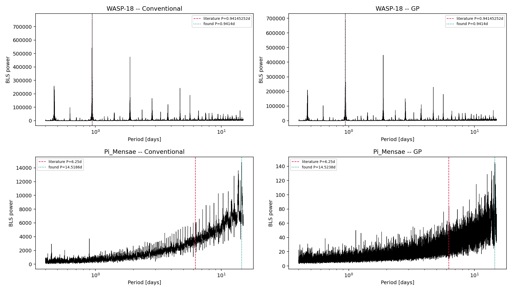
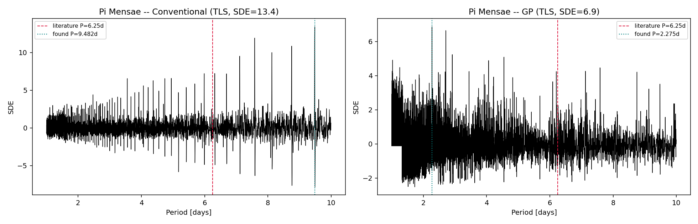

# TESS Transit Detection: Conventional vs. Gaussian-Process Detrending

A transit-detection pipeline built and validated on **real TESS photometry**, comparing conventional sliding-window detrending against Gaussian-Process (GP) detrending - not by whose residuals look quieter, but by which one actually **recovers more real transits**, measured through controlled signal-injection experiments.

Validated on WASP-18 b (recovers its published orbital period to 0.0028% accuracy, fully blind). Stress-tested on Pi Mensae c, a real transiting planet too faint for either method to detect outright. The central result: GP detrending achieves a lower noise floor in every test, but that advantage **does not translate into better detection sensitivity** - and the reason why is diagnosed, not just observed.

📄 **[Full written report](report/TESS_Transit_Detection_Report.pdf)** (also available as [.docx](report/TESS_Transit_Detection_Report.docx))

---

## The headline result



Across 120 injected synthetic transits (6 depths × 10 periods × 2 methods) planted into real Pi Mensae c stellar noise, conventional detrending climbs to a clean, statistically confident **100% recovery by 700 ppm**. GP detrending plateaus at **40% and never improves** - even at 2000 ppm, a depth roughly 3× deeper than where conventional already reaches perfection. Error bars are 95% Wilson score confidence intervals; at 700 ppm and above they no longer overlap, meaning this gap is a defensible statistical claim, not just a visual impression.

That number alone would be a fine result. What makes it a *finding* rather than just a benchmark is what's underneath it:



The 40% isn't a smooth sensitivity limit at all. Per-period, GP's behavior splits into three distinct regimes: some periods (3.7, 6.1, 6.9 days) recover cleanly past a depth threshold, just like conventional detrending does; some periods (4.3, 5.1, 7.7 days) are **never recovered at any depth**, including 2000 ppm; and a third group is recovered at some depths but inexplicably lost at higher ones - which shouldn't happen if depth alone were the limiting factor.

Both of those anomalies were tracked down, not left as a shrug:

- **The ~8.75-day "detection" at low injected depths** is not related to the injection at all - running the search on Pi Mensae's GP-detrended data with *nothing* injected independently returns the same 8.75-day period. It's a pre-existing residual systematic in the GP fit that simply outcompetes a too-weak fake signal.
- **The never-recovered periods** were tested directly: re-fitting the GP with an *oracle mask* covering the exact true transit location (only possible because the truth is known here) flips at least one of them from a clean failure to a clean recovery. That's direct evidence that GP, fit blind — as it must be in a real discovery scenario - can partially absorb an unmasked transit into its own model of stellar variability, in a way a short-window conventional filter does not.

## Also in here: a full validation and an honest non-detection

| | |
|---|---|
|  | A fully blind search (no period supplied) recovers WASP-18 b's published 0.94145252-day orbital period to **0.0028% accuracy**, SNR > 1000, for both detrending methods - full pipeline validation on real, unmodified TESS data. |
|  | Pi Mensae c's real ~230 ppm transit is **not** recovered by either method with standard search tools (BLS or TLS). This is reported as a negative result, not hidden - and it matches the planet's actual discovery history, which leaned on radial-velocity data, not photometry alone. |

## Repository structure

```
├── scripts/
│   ├── download_data.py            # Pull real SPOC light curves from MAST via lightkurve
│   ├── detrend_conventional.py     # wotan biweight detrending + transit masking
│   ├── gp_detrend.py               # celerite2 GP detrending (rotation kernel)
│   ├── transit_search.py           # Box Least Squares (BLS) search
│   ├── transit_search_tls.py       # Transit Least Squares (TLS) search
│   └── injection_recovery.py       # Signal-injection completeness experiment
├── data/
│   ├── WASP-18.csv, Pi_Mensae.csv  # Raw downloaded light curves (real TESS data)
│   ├── injection_recovery_results.csv
│   └── completeness_summary.csv    # Recovery rates + Wilson score CIs, by depth/method
├── results/                        # All figures, generated by the scripts above
└── report/                         # Full written report (.docx and .pdf)
```

Large derived intermediates (flattened light curves) are excluded from the repo via `.gitignore` - they're fully regenerated by running the detrending scripts against the raw data included here.

## Reproducing this

```bash
pip install -r requirements.txt

python scripts/download_data.py          # needs internet access to MAST
python scripts/detrend_conventional.py
python scripts/gp_detrend.py
python scripts/transit_search.py
python scripts/transit_search_tls.py
python scripts/injection_recovery.py      # takes several minutes
```

Each script is independently runnable and regenerates its corresponding figures in `results/`.

## Honest limitations

- Injection-recovery was run against a single star's real noise properties, with fixed transit geometry (only depth and period varied).
- 10 periods per depth is enough to make the headline claim statistically defensible (see confidence intervals above), but individual percentages still carry real sampling uncertainty - this is stated explicitly, not glossed over.
- The recovery criterion (period match within 1%) doesn't credit harmonic aliases as partial detections, which is a deliberately strict choice, documented in the code.
- GP detrending showed measurable run-to-run non-determinism from its numerical optimizer across different machines - a genuine methodological property of optimizer-based detrending that a classical filter doesn't share.

The full report's Discussion and Limitations sections go into this in more depth.

## Tools used

`lightkurve` · `astropy` · `wotan` · `celerite2` · `batman-package` · `transitleastsquares` · `scipy` · `numpy` / `pandas` / `matplotlib`

## License

MIT - see [LICENSE](LICENSE).
